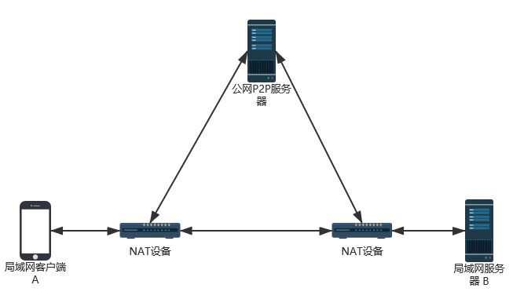
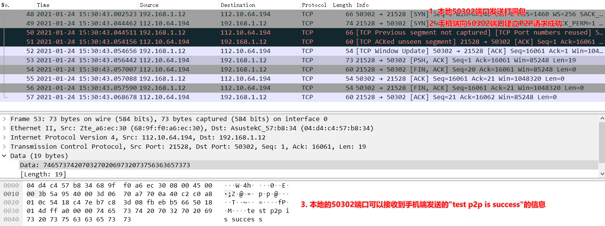
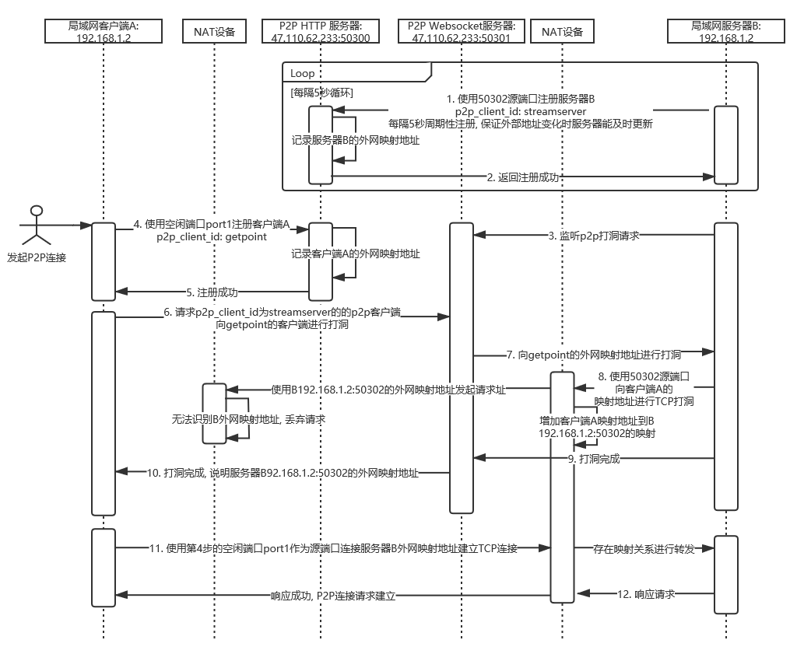

# P2PNetConnect

P2P(peer to peer)内网穿透, 用于Java客户端(例如Android手机)和未获取到公网IP的Windows或Linux服务端的TCP(Transmission Control Protocol)通信.

作者主要是想做个视频软件, 需要搭个30Mbps上行带宽左右的流媒体服务器, 租赁公网服务器带宽比较贵, 想通过P2P节省点费用... 之后应该会基于本项目再做个P2P视频软件.

## 网络结构

涉及到节点有处在公网的P2P服务器, 处于局域网下的客户端A和服务器B, **目的是让A和B在公网P2P服务器的协助下直接透过NAT(Network Address Translation)设备通信**.


## 主要功能特点

- 公网P2P服务器和局域网服务器B的程序使用Python3.8开发, 可以运行Python3.8的操作系统预期都可以, 例如Windows, Linux等
- 客户端(网络结构中的客户端A)使用Java开发
- 秒获取P2P连接

## 安装部署

根据网络结构中的介绍, 需要部署3个节点的环境, **1, 2为必须步骤, 按照个人需求可选第3步或者第4步, 验证P2P可行性可以先使用提供的AndroidDemo进行第3步测试, 如果你已经开发了Java客户端, 希望复用P2P的连接, 可以按照第4步进行操作.**

### 1. 搭建公网P2P服务器

- 下载P2PServer, 将该文件夹放置在能够运行Python3.8的公网主机上

- 修改P2PServer/config.json, 需要占用两个空闲端口, 注意删除"//"以及该行之后的注释

  ```text
  {
    "local_ip": "47.110.62.233", //公网服务器的公网IP
    "http_port": 50300, // http使用的空闲端口
    "websocket_port": 50301 // websocket使用的空闲端口
  }
  ```

- 执行脚本启用P2P服务器(示例运行在Linux系统):

  ```shell
  ~/workspace/P2PServer# python P2PServer.py
  Starting server, listen at: 0.0.0.0:50300
  Starting P2PManageWebSocket server, listen at: 0.0.0.0:50301
  ```

### 2. 搭建局域网服务器环境

- 按照个人需求启动服务端口监听请求, 此次在网络结构中的局域网服务器B监听50302端口

- 修改P2PServer/config.json, 注意删除"//"以及该行之后的注释:

```text
  {
    "p2p_server_address": "http://47.110.62.233:50300", //填写1中对应的地址
    "p2p_client_id": "streamserver", //p2p客户端id, P2P公网服务器进行记录, 用于局域网客户端A进行填写
    "local_server_port": 50302 //本地服务端口
  }
```

- 下载P2PClientForServer, 执行脚本(示例为在Windows主机上运行):

  ```shell
  "C:\Program Files (x86)\Python38-32\python.exe" C:\Users\getpoint\P2PClientForServer\P2PClientForServer.py
  200 b'{"ip": "47.110.62.233", "port": 50301}'
  reconnect ws://47.110.62.233:50301/p2pinfo/subscribe
  ```

### 3. 搭建手机环境测试

- 下载P2PClientForAndroidClient进行编译, 在手机端进行运行

- 填写P2P服务器地址, 本地ID(不应重复)以及对端ID(第2步中填写的p2p_client_id), 填写完成后点击P2PTest

- 界面将提示是否连接成功, 如下截图表示**280 ms内获取P2P连接成功**, 客户端A使用192.168.1.10:41770地址, 连接112.10.64.194:21872地址, 即可连接到第2步部署的局域网服务, "p2p test success"可以说明打洞已经成功
  
  
- 另外在局域网服务器B端进行抓包, 也可以看到手机端的请求已经到达

  
  
## 4. 自构建Java客户端复用P2PClient模块

- 下载P2PClientForAndroidClient, 复用其中的com.getpoint.p2pclient模块, 使用其中的getP2PLocalPeerAddress方法:

  ```Java
  /**
   * 获取能够通过p2p打洞连接远端的本地地址以及对端的地址, 暂不支持重入
   * @param p2p_server_ip   在公网上的p2p服务器ip
   * @param p2p_server_port   在公网上的p2p服务器端口
   * @param local_client_id   需要注册到p2p服务器上的本地client_id, 告知对端连接本地client_id
   * @param peer_client_id   需要通过p2p连接的对端的client_id
   * @return  success return LocalPeerAddress or fail return null
   */
  public LocalPeerAddress getP2PLocalPeerAddress(String p2p_server_ip, int p2p_server_port, String local_client_id, String peer_client_id)
  ```

- 代码编写如下:
  ```Java
  import com.getpoint.p2pclient.LocalPeerAddress;
  import com.getpoint.p2pclient.P2pClient;
  
  P2pClient p2pClient = new P2pClient();
  // 获取本地和对端需要使用的地址
  LocalPeerAddress localPeerAddress = p2pClient.getP2PLocalPeerAddress("47.110.62.233", 50300, "getpoint", "streamserver");
  if (null == localPeerAddress) {
      System.out.println("getP2PLocalPeerAddress failed");
      return;
  }
  System.out.println("getP2PLocalPeerAddress success " +
                     "local_id: " + localId + ", localadress: " + localPeerAddress.LocalAddress + "\n" +
                     "peer_id: " + peerId + ", peeradress: " + localPeerAddress.PeerAddress + "\n");
  
  // 使用获取得到的地址, 建立TCP连接, 测试p2p是否打洞成功, 获取到的地址应立即使用避免端口被NAT设备回收
  Socket socket = new Socket();
  try {
      SocketAddress socAddress = new InetSocketAddress(localPeerAddress.PeerAddress.ip, localPeerAddress.PeerAddress.port);
      SocketAddress localSocAddress = new InetSocketAddress(localPeerAddress.LocalAddress.ip, localPeerAddress.LocalAddress.port);
      socket.bind(localSocAddress);
      socket.connect(socAddress, 5000);
      socket.setSoTimeout(5000);
      OutputStreamWriter out = new OutputStreamWriter(socket.getOutputStream());
      out.write("test p2p is success");
      out.flush();
      // 连接成功并发送数据成功认为p2p成功
      System.out.println("p2p test success");
  } catch (IOException e) {
      System.out.println("p2p test fail");
      e.printStackTrace();
  }
  try {
      socket.close();
  } catch (IOException e) {
      System.out.println("socket.close fail");
      e.printStackTrace();
  }
  ```
  
- 示例中说明了获取到P2P地址后建立TCP连接发送"test p2p is success"数据的方法,  实际根据使用需要可以将获取到的地址用于自己的业务

## 使用限制说明

- 目前仅支持局域网客户端A以及局域网服务器B都处在非对称的锥形NAT环境下建立P2P连接

## 交互流程详细说明

建议看本项目时序图前, 不了解P2P的读者可以先获取一些基础知识, 以下为网络结构各端进行的交互流程:

 

**备注:**

- 网络结构图中的P2P服务器在时序图中分解为P2P HTTP服务器和P2P Websocket服务器方便理解, 实际是在一个程序中运行, 数据共享.
- 安装部署中的3搭建手机环境测试中获取P2P连接耗时280 ms, 是指从第4步到底10步的耗时.

## 技术支持

邮件：[getpoints@qq.com](mailto:getpoints@qq.com)(欢迎提建议或技术讨论)
